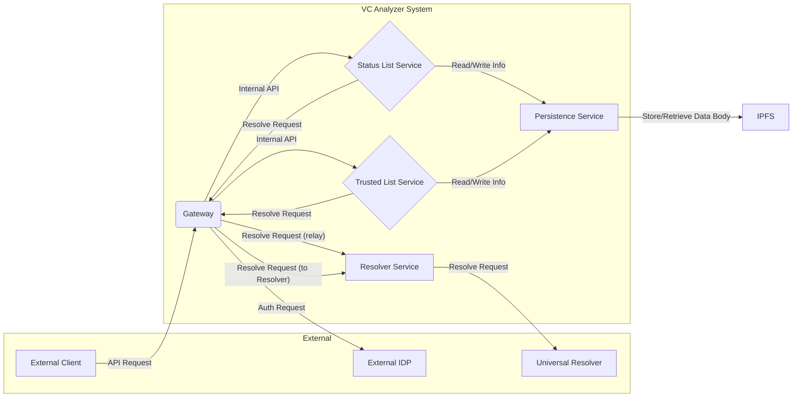

# 1. システム概要
## 1.1 目的と背景
本システムの目的は、Verifiable Credentials (VC) の発行および検証プロセスにおいて必要となる共通機能基盤を提供するアプリケーションです。これにより、VC の普及を促進し、関連する開発コストを削減することを目指します。
### 目的
- 検証者に対して: DID 解決、VC の失効確認、および発行者の信頼性確認といった一連の検証プロセスを、容易かつ効率的に実行するための機能を提供します。
- VC 発行者に対して: ステータスリストやトラステッド発行者リストといった、VC 発行において核となる情報の登録、更新、削除といった管理作業を、容易に行うための機能を提供します。
### 課題
Verifiable Credentials のエコシステムにおいて、VC の発行および検証を行うために必要な共通機能（DID 解決、ステータス管理、信頼できる発行者管理など）を個別に構築することは、開発コストの増加を招き、DID/VC の普及における障壁となっています。本システムは、これらの共通機能を提供するアプリケーションとして、開発コストを削減し、より多くのサービスが DID/VC を容易に活用できるようにすることを目指します。
## 1.2 システム全体の役割
VC Analyzer System は、Verifiable Credentials (VC) エコシステムにおいて、VC の発行と検証を支援するための基盤として機能します。本システムは、VC 発行者、VC 提示者 (Holder)、VC 検証者 (Verifier) といった主要なアクターと連携し、VC の信頼性を確保するための様々な機能を提供します。

VC 発行フロー:
1. VC 発行者は、Gateway に対して、VC のメタデータやステータスリスト情報を登録するための API を呼び出します (この際、Access Token を用いて認証を行います)。
2. Gateway は、IDP (Identity Provider) と連携して VC 発行者の認証を行い、認証に成功した場合は、内部用の JWT を発行します。
3. Gateway は、認証・認可済みのリクエストを、Status List Service や Trusted List Service へ転送します。
4. Status List Service は、VC の失効状態を管理するためのリストを生成し、IPFS に保存します。また、VC 発行者が提供する登録情報を管理します。
5. Trusted List Service は、信頼できる VC 発行者のリストを管理し、IPFS に保存します。こちらも、VC 発行者が提供する登録情報を管理します。
6. Status List Service と Trusted List Service は、処理結果を Gateway へ応答します。
7. Gateway は、VC 発行者に対して処理結果を応答します。
VC 検証フロー:
1. VP 提示者 (Holder) は、VP を VP 検証者 (Verifier) に提示します。
2. VP 検証者は、提示された VP の信頼性を検証するために、Trusted List Service と連携し、発行者の信頼性を確認します。
3. rusted List Service は、登録情報から発行者リストの CID を取得し、IPFS から発行者リストを取得して、VP の署名検証を行います。また、発行者の DID を解決するために、Resolver Service と連携します。
4. Trusted List Service は、検証結果を VP 検証者に応答します。
5. VP 検証者は、VC の失効状態を確認するために、Status List Service と連携します
6. Status List Service は、登録情報からステータスリストの CID を取得し、IPFS からステータスリストを取得して、VP の失効状態を確認します。また、ステータスリスト作成者の DID を解決するために、Resolver Service と連携します。
7. Status List Service は、検証結果を VP 検証者に応答します。
8. VP 検証者は、Holder と Issuer の DID を解決するために、Gateway 経由で Resolver Service と連携します。
9. Resolver Service は、DID Document を Gateway に応答します。
10. Gateway は、VP 検証者に対して、すべての検証結果を応答します。

(スコープ外)

- VP 検証者は、上記に加えて、VP の内容自体 (クレームなど) の検証を行う場合がありますが、これは本システムのスコープ外となります。
- VP 検証者は、検証結果を VP 提示者に応答します。
- 
## 1.3 主要なコンポーネント
システムは、以下の主要なコンポーネントで構成されます。これらのコンポーネントは連携し、VC の発行および検証に関連する機能を提供します。
コンポーネント図:

システム構成:
- Gateway
    - 本システムへの外部からの API リクエストを受け付けるエントリポイントです。
    - 外部クライアントが提示する Access Token を用いて認証および認可を行い、正当なリクエストのみをバックエンドサービスへ転送します。
    - システム内の他のコンポーネントからの、Resolver Service への DID 解決リクエストを中継します。
    - 必要に応じて、バックエンドサービスからの応答に対して、フォーマット変換や不要情報の削除といった調整（レスポンスの変換）を行います。
- Status List Service
    - VCの失効状態を管理するサービスである
    - VC 発行者などからのリクエストを受け付け、ステータスリストの生成、更新、管理を行う API を提供します。
    - ステータスリストのデータ本体の永続化や取得に関しては、Persistence Service に依頼します。
    - IPFS から取得したステータスリストデータに対して、システム運営者の公開鍵を用いて署名検証を行い、データの改ざんがないことを確認します。
    - Gateway から伝達された認可情報に基づき、リソース（ステータスリストなど）に対する操作の権限チェックを行います。
    - VP 検証者などに対して、ステータスリストの情報を取得するための機能も提供します。
- Trusted List Service
    - 信頼できる VC 発行者に関する情報を管理するサービスです。
    - トラステッド発行者の登録、更新、削除を行う API を提供します。
    - トラステッド発行者に関するデータは IPFS と連携して永続化します。IPFS に保存されたデータの実体（CID）と、発行者 DID といった管理情報を、システム内部で永続化します。
    - IPFS から取得したトラステッド発行者データに対して、システム運営者の公開鍵を用いて署名検証を行い、データの改ざんがないことを確認します。
    - Gateway から伝達された認可情報に基づき、リソース（トラステッド発行者情報など）に対する操作の権限チェックを行います。
    - VP 検証者などに対して、トラステッド発行者リストの情報や個別の発行者情報を取得するための機能も提供します。
- Resolver Service
    - システム内の他のコンポーネント（Gatewayなど）からの要求を受け、指定された DID の DID Document を解決し、その結果を応答する、DID 解決機能を提供する内部サービスです。
    - 外部の Universal Resolver を利用して、様々な DID メソッドに対応した解決機能を提供します。
    - このサービスは DID Document の「解決」に特化しており、VP の Proof 検証といった上位レベルの「検証」機能は行いません。
- Persistence Service
    - トラステッド発行者 DID と IPFS の CID、ステータスリスト ID と IPFS の CID といった、システム内部で管理する主要なメタ情報（内部管理情報）の永続化と取得を専門に担当するコンポーネントです。
    - Status List Service や Trusted List Service からのリクエストを受けて、これらの情報の読み書きを行います。
    - 本コンポーネントは、現時点ではファイルシステムを永続化層として使用して内部管理情報を管理していますが、永続化方法については今後の検討課題であり、将来的にはデータベースへの移行などを想定しています。

## 1.4 主要な機能
VC アナライザー システムは、以下の主要な機能を提供します。

システムが管理、処理するデータ:
- ステータスリスト管理:
  - 指定されたサイズの新しいステータスリストインスタンスを作成する。
  - 既存のステータスリスト内の特定エントリのステータス（例: 失効済み）を更新する。
  - ステータスリスト内の特定エントリのステータス（例: 有効または失効済み）を確認する。
- トラステッドリスト管理:
- 新しい信頼できる VC 発行者を登録する（その DID および有効期間を記録する）。
- 既存のトラステッド発行者の情報を更新する（例: 有効期間を変更する）。
- 登録済みのトラステッド発行者を削除する。
- 特定のトラステッド発行者の情報を取得する（例: 現在信頼されているかを確認する）。
- 登録済みのトラステッド発行者のリストを取得する。
- DID 解決:
  - 外部 Universal Resolver を利用して、指定された DID を解決し、対応する DID Document を取得する。