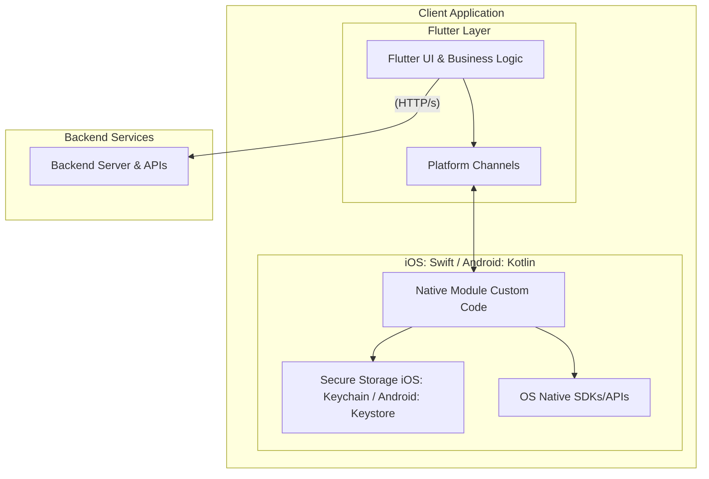

# Flutterがもたらす新しいアプリ開発の形

## 1. はじめに：アプリ開発の新たな標準「Flutter」
- ポイント: モバイルアプリ開発の現状と課題、そしてそれに対するFlutterの立ち位置を簡潔に紹介します。
- 内容:
  - 今日のビジネスにおけるモバイルアプリの重要性
  - 従来のiOS/Android別々の開発が抱える課題（コスト、時間、一貫性など）
「クロスプラットフォーム開発」という解決策
  - その中でもFlutterが、なぜ次世代の標準として注目されているのか 

## 2. 強み1：ワンコードベースでの真のクロスプラットフォーム展開
- ポイント: Flutterの最も分かりやすいメリットである「iOSもAndroidも一つのコードで」を実現する仕組みと、それがもたらすビジネス上の価値を強調します。
- 内容:
    - 「たった一つのコードベース」で両プラットフォームに対応:
      - Dart言語で書かれたコードが、iOS（ARMコード）とAndroid（ARMコード）のネイティブバイナリに直接コンパイルされます。
      - これにより、iOSアプリとAndroidアプリを別々に開発・メンテナンスする手間が不要になります。
  - 圧倒的な開発効率とコスト削減:
    - 開発期間の短縮、人的リソースの最適化、バグ修正や機能追加の効率化を実現し、開発・運用コストを大幅に削減します。
  - 一貫したユーザー体験とブランドイメージ:
    - どのデバイスでも同じ見た目、同じ機能、同じ挙動を提供できるため、ユーザーは混乱なく、  アプリのブランドを強く意識できます。

## 3. 強み2：ネイティブを凌駕するパフォーマンスと生産性
- ポイント: 他のクロスプラットフォーム技術（例：React Native）との比較を通じて、Flutterの技術的な優位性（特に描画エンジンとコンパイル方式）と、それがもたらす開発生産性の高さを明確にします。
- 内容:
  - 既存のクロスプラットフォーム技術との決定的な違い:
    - React Nativeなど: JavaScriptからネイティブUIコンポーネントへの「ブリッジ」変換が必要。このブリッジが複雑なUIやアニメーションのボトルネックになることがあります。
    - Flutter: Google独自の高性能レンダリングエンジン「Skia（スキア）」を搭載し、アプリのUIを直接描画します。これにより、OSのネイティブUIコンポーネントへの依存がありません。
  - 「Skia」が実現する高速描画:
    - ゲームエンジンがグラフィックを描画するのと同様の原理で、非常に滑らかで高速なUI描画を実現。複雑なアニメーションやトランジションも、フレーム落ちなくスムーズに動作します。
  - Dart言語とコンパイル方式による生産性向上:
    - ネイティブパフォーマンス: Dartコードが直接ネイティブバイナリにコンパイルされるため、実行速度が非常に高速。ネイティブアプリと区別がつかないほどのパフォーマンスを実現します。
    - ホットリロード / ホットリスタート: 開発中のコード変更が、数秒でアプリに反映される画期的な機能。UIの微調整やバグ修正が飛躍的に効率化され、開発者の生産性を劇的に向上させます。
    - 型安全性: Dartの強力な型システムにより、大規模なプロジェクトでも堅牢で保守性の高いコードを記述できます。

## 4. 強み3：柔軟なUIデザインと、最適なデザイン規格の選択
- ポイント: FlutterのUI自由度と、アプリの目的に合わせたデザイン規格の選択肢があることを示し、そのメリット・デメリットを整理して説明します。
- 内容:
  - あらゆるデザインを忠実に再現可能: Flutterは高度なカスタマイズ性を持つウィジェットを提供し、デザイナーの意図するあらゆるUIをピクセル単位で忠実に再現できます。

  - 選べるデザイン戦略：アプリの目的とユーザーに合わせた最適化:

    - A. Material Designに統一するアプローチ

      - 概要: Googleが提唱する、紙とインクのメタファーに基づいたモダンなデザインシステム。Flutterの標準ウィジェットがこれに準拠。
      - メリット:
        - 究極のワンコードデザイン: iOS/Android間で完全に統一されたUIを実現し、デザイン・開発の手間を最小化。
        - 一貫したブランド体験: プラットフォームを問わず、アプリのブランドイメージを強力に確立。
      - デメリット: iOSユーザーにとって、見慣れないUIと感じられる可能性（「ネイティブ感が薄い」という印象）。
    - B. プラットフォームごとのデザインに最適化するアプローチ

      - 概要: iOSではCupertino design（AppleのHuman Interface Guidelinesに基づくiOS標準UI）、AndroidではMaterial Designと、各OSのUI/UXに寄せる。
      - メリット:
        - 高いユーザー親和性: 各プラットフォームのユーザーが慣れ親しんだ見た目と操作感を提供し、自然な体験を実現。
        - OSとの高い調和性: ネイティブアプリと遜色ない「しっくりくる」操作感を提供。
      - デメリット:
        - 実装コストの増加: OSごとのUI切り替えロジックが必要になり、開発・メンテナンスの手間がやや増加。
        - デザインの一貫性維持の課題: 異なるデザインガイドラインを採用するため、アプリ全体のブランドイメージを一貫させるための緻密な設計が必要。
        - 最適な選択のために: アプリのターゲットユーザー、ブランド戦略、開発リソースを総合的に考慮し、最も効果的なデザインアプローチを選択することが重要です。
  
## 5. 高度な機能連携とセキュアなアーキテクチャ
- ポイント: FlutterがUIだけでなく、OS固有の高度な機能やセキュリティ要件にも対応できることを示し、信頼性を高めます。
- 内容:
  - ネイティブ機能へのシームレスなアクセス:
    - Platform Channelsを通じて、Flutter（Dart）からiOS（Swift）やAndroid（Kotlin）のネイティブコードを直接呼び出すことが可能。
    - カメラ、GPS、Bluetooth、特定のハードウェア機能、OS固有のSDK（Apple Pay、HealthKitなど）へのアクセスを実現。
  - 機密情報を守るセキュアな連携:
    - 秘密鍵などの機密データは、OSネイティブの安全なストレージに保管（iOS: Keychain / Android: Keystore）。
    - Flutterから直接アクセスせず、Swift/Kotlin側のセキュアなモジュールがこれらの情報を管理・利用し、必要な処理（例：データ署名）を実行した結果のみをFlutterに返します。
    - これにより、高いセキュリティレベルを維持しつつ、安全なトランザクション処理などを実現します。
  - モジュール化による開発・管理の効率化:
    - 特定のネイティブ処理を独立したライブラリ（Flutterプラグイン）として切り出すことで、コードの再利用性、チーム開発の効率性、テストの容易性が向上します。
    - コンポーネント図によるアーキテクチャの視覚化:

## 6. まとめ：Flutterで未来のアプリを
- ポイント: これまでの内容を総括し、Flutter導入のメリットを再強調します。
- 内容:
  - 高パフォーマンス: ネイティブと遜色ないスムーズな動作。
  - 高生産性: 圧倒的な開発効率とコスト削減。
  - 高自由度: デザインと機能の両面で柔軟な対応力。
  - 高い信頼性: セキュアなアーキテクチャとネイティブ連携の可能性。
  - 「Flutterは、ビジネスのスピードとアプリの品質、そしてユーザー体験を同時に高めるための最適な選択肢です。」